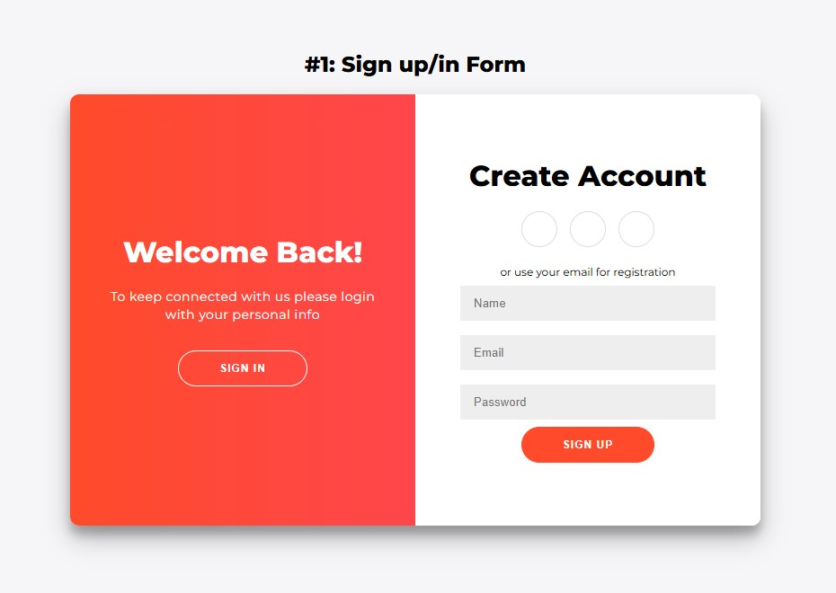

# SignUp-SignIn-Page

**#1: Sign up/in Form**

This repository contains the code for a stylish and responsive sign-in/sign-up form, created as part of a coding challenge. Built using HTML, CSS, and a touch of JavaScript, this project delivers a simple yet engaging user experience!

## 📸 Preview

## 🎯 Features
- Modern and responsive design
- Smooth animation for switching between sign-in and sign-up
- Support for email and password-based authentication
- Styled with pure CSS

## 🚀 Getting Started
1. Clone the repository:
2. git clone https://github.com/MrSoliDev/SignUp-SignIn-Page.git Place the files in a folder.
3. Open the `index.html` file in your browser and enjoy!

## 💻 Usage
- Test the "Sign In" and "Sign Up" buttons to experience the animation.
- Feel free to edit the code and customize the styles to your liking.

## 🤝 Contributing
Want to help? Fork the repository, make your changes, and submit a pull request! I’d love to hear your ideas and suggestions.

## 🙌 Acknowledgments
This project is coded by https://t.me/SalehMonfared.
